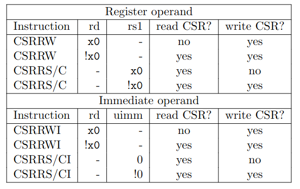

# riscv_ctb_challenges
This file contains the result description for the RISC-V CTB Hackathon 2023. Th following section links to the description of each of the presented challenges. For the third challenge level, a custom design was used, the planigale-riscv. The design is a RV32I compliant implementation, as verified in the third challenge and supports the M-mode.

## Challenge Overview
***Level 1***
- [challenge1_logical](#challenge1_logical)
- [challenge2_loop](#challenge2_loop)
- [challenge3_illegal](#challenge3_illegal)

***Level 2***
- [challenge1_instructions](#challenge1_instructions)
- [challenge2_exceptions](#challenge2_exceptions)

***Level 3***

- [challenge1_arithmetic](#challenge1_arithmetic)
- [challenge2_loadbyte](#challenge2_loadbyte)
- [challenge3_csrs](#challenge3_csrs)

# Challenge_level1

# challenge1_logical 
The initial behavior of the ```make all``` command in the given challenge folder produces the following output and errors for the compile stage:

```assembly
test.S: Assembler messages:
test.S:15855: Error: illegal operands `and s7,ra,z4'
test.S:25584: Error: illegal operands `andi s5,t1,s0'
```

Cause of Error in line test.S:15855: 

 ```z4``` is not a valid CPU register. the ```and``` instruction takes two registers as input and writes the result to the given output. The line can be fixed by using a valid register, for example ```t4```:
```assembly
and s7,ra,t4
```

Cause of Error in line test.S:25584:

 ```andi``` requires an immediate value, not two input registers as the ```and``` instruction. As all other instructions in the test are ```and``` instructions, this is most likely a typo-error in the test.

The Error can therefore be fixed by using the ```and``` instruction:
```assembly
and s5,t1,s0
```

These two changes fix the test execution. The updated file can be is located [here](challenge_level1/challenge1_logical/test.S).


# challenge2_loop

When executing ```make all``` in the challenge2_loop directory, the ```spike``` command can only be aborted using the manual exit ```Ctrl+C```.

The root cause of this is, that the function loop is never exited in the given test case.
As the input data for the loop features three data pairs, and cpu register ```t5``` is loaded with the value of three before entering the loop function, what misses in the loop is a branch statement as soon as all data is compared.

Here is the proposed solution, decrement the **testcase-counter variable** stored in ```t5```, and jump to ```test_end``` once the counter reaches **0**.
```assembly
loop:
  lw t1, (t0)
  lw t2, 4(t0)
  lw t3, 8(t0)
  add t4, t1, t2
  addi t0, t0, 12
  addi t5, t5, -1         # decrement test counter
  beqz t5 , test_end      # if end of data is reached, end loop
  beq t3, t4, loop        # check if sum is correct
  j fail

test_end:

TEST_PASSFAIL
```

The following spike output shows the traces of the first loop execution, which helped identify the root cause of the error:
```listing
code
core   0: 3 0 0x800001b8 (0x00c28293) x5  0x80003d10
core   0: 3 0 0x800001bc (0xffde06e3)
core   0: 3 0 0x800001a8 (0x0002a303) x6  0x00000000 mem 0x80003d10
core   0: 3 0 0x800001ac (0x0042a383) x7  0x00000000 mem 0x80003d14
core   0: 3 0 0x800001b0 (0x0082ae03) x28 0x00000000 mem 0x80003d18
core   0: 3 0 0x800001b4 (0x00730eb3) x29 0x00000000
core   0: 3 0 0x800001b8 (0x00c28293) x5  0x80003d1c
```


The values of ```x28``` and ```x29``` are compared in the loop, then the address in ```t0/x5``` is incremented, to check the next data pair.

The fixed test case file can be found [here](challenge_level1/challenge2_loop/test.S).

# challenge3_illegal

The provided test case does not provide a call to the **pass** function meaning that the test cannot be completed correctly, even if the behavior matches the expectations. Therefore the proposed improvement of the test case features a check in the ```mtvec_handler``` that the address that caused the interrupt is the ```illegal_instruction```. If so, the ```test_end```-address is loaded to the ```mepc``` register, so that after exiting the interrupt handler, the ```pass``` function is called. This leads to the correct behavior of the test case:

```assembly
.align 2
.option norvc

li TESTNUM, 2
illegal_instruction:
  .word 0              
  j fail

.align 4
.global mtvec_handler
mtvec_handler:
  li t1, CAUSE_ILLEGAL_INSTRUCTION
  csrr t0, mcause
  bne t0, t1, fail
  csrr t0, mepc               # mepc should point to illegal_instruction
  la t1, illegal_instruction  # load actual address of illegal_instruction
  bne t0, t1, fail            # check that cause for trap was our illegal instruction
  la t0, test_end             # load address of test_end
  csrw mepc, t0              # set mepc to test_end, to pass test
  mret


test_end:

  TEST_PASSFAIL
```

At 0x800001fc, the ```mret``` instruction is called, returning from the ```mtvec_handler```. The next instruction is called from 0x800001cc, the first line of ```pass```. After completing this function, the ```trap_vector``` is called again, this time continuing to ```write_tohost```, indicating to the host, that the test was passed successfully and the illegal instruction was processed as expected.
The following section shows the trace of the spike simulation:

```assembly
core   0: 3 0x800001ec (0x341022f3) x5  0x800001a4
core   0: 3 0x800001f0 (0x00000297) x5  0x800001f0
core   0: 3 0x800001f4 (0xfdc28293) x5  0x800001cc
core   0: 3 0x800001f8 (0x34129073) c833_mepc 0x800001cc
core   0: 3 0x800001fc (0x30200073) c768_mstatus 0x00000080
core   0: 3 0x800001cc (0x0ff0000f)
core   0: 3 0x800001d0 (0x00100193) x3  0x00000001
core   0: 3 0x800001d4 (0x05d00893) x17 0x0000005d
core   0: 3 0x800001d8 (0x00000513) x10 0x00000000
core   0: 3 0x80000004 (0x34202f73) x30 0x0000000b
core   0: 3 0x80000008 (0x00800f93) x31 0x00000008
core   0: 3 0x8000000c (0x03ff0a63)
core   0: 3 0x80000010 (0x00900f93) x31 0x00000009
core   0: 3 0x80000014 (0x03ff0663)
core   0: 3 0x80000018 (0x00b00f93) x31 0x0000000b
core   0: 3 0x8000001c (0x03ff0263)
core   0: 3 0x80000040 (0x00001f17) x30 0x80001040
core   0: 3 0x80000044 (0xfc3f2023) mem 0x80001000 0x00000001
core   0: 3 0x80000048 (0x00001f17) x30 0x80001048
core   0: 3 0x8000004c (0xfa0f2e23) mem 0x80001004 0x00000000
```

The following section shows the disassembly of the proposed updated test case:

```assembly
800001e0 <mtvec_handler>:
800001e0:	00200313          	li	t1,2
800001e4:	342022f3          	csrr	t0,mcause
800001e8:	fc6294e3          	bne	t0,t1,800001b0 <fail>
800001ec:	341022f3          	csrr	t0,mepc
800001f0:	00000297          	auipc	t0,0x0
800001f4:	fdc28293          	addi	t0,t0,-36 # 800001cc <pass>
800001f8:	34129073          	csrw	mepc,t0
800001fc:	30200073          	mret
80000200:	c0001073          	unimp

800001cc <pass>:
800001cc:	0ff0000f          	fence
800001d0:	00100193          	li	gp,1
800001d4:	05d00893          	li	a7,93
800001d8:	00000513          	li	a0,0
800001dc:	00000073          	ecall
```
The updated test case file can be found [here](challenge_level1/challenge3_illegal/test.S).

# Challenge_level2

# challenge1_instructions

This challenge features the aapg python package, which can be used to generate test cases for the risc-v DUT. [3]

The provided [configuration file](challenge_level2/challenge1_instructions/rv32i.yaml) however leads to the following error, when running the ```make all``` command:

```assembly
test.S: Assembler messages:
test.S:156: Error: unrecognized opcode `divuw s4,a3,t4'
test.S:157: Error: unrecognized opcode `remw s6,s6,s11'

```

When checking te RISC-V Specification [1], it can be seen, that the two opcodes are defined for the ```rv64i``` ISA.

With this information the following statement in the **yaml**-file was identified:

```python
-instruction-distribution:
  ...
  rel_rv64m: 10
  ...
```
This line adds a certain percentage of ```rv64i``` opcodes to the generated test.

The corrected file can be found [here](challenge_level2/challenge1_instructions/rv32i.yaml), and the changed line are shown in the following snipped:

```python
isa-instruction-distribution:
  rel_sys: 0
  rel_sys.csr: 0
  rel_rv32i.ctrl: 0
  rel_rv32i.compute: 10
  rel_rv32i.data: 10
  rel_rv32i.fence: 10
  rel_rv64i.compute: 0
  rel_rv64i.data: 0
  rel_rv32i.zba: 0
  rel_rv64i.zba: 0
  rel_rv32i.zbb: 0
  rel_rv64i.zbb: 0
  rel_rv32i.zbc: 0
  rel_rv32i.zbs: 0
  rel_rv32i.zbe: 0
  rel_rv64i.zbe: 0
  rel_rv32i.zbf: 0
  rel_rv64i.zbf: 0
  rel_rv64i.zbm: 0
  rel_rv32i.zbp: 0
  rel_rv64i.zbp: 0
  rel_rv32i.zbr: 0
  rel_rv64i.zbr: 0
  rel_rv32i.zbt: 0
  rel_rv64i.zbt: 0
  rel_rv32m: 0
  rel_rv64m: 0      # Here was a 10 in the original config file.
  rel_rv32a: 0
  rel_rv64a: 0
  rel_rv32f: 0
  rel_rv64f: 0
  rel_rv32d: 0
  rel_rv64d: 0
```


# challenge2_exceptions

The second challenge of the second level is to generate a test case which causes **10 illegal instruction errors**.
However the provided folder structure only features a [Makefile](challenge_level2/challenge2_exceptions/Makefile), which features a ```gen``` stage. Therefore a **yaml**-file is created to generate the test case file. 

To generate **illegal instruction errors**, it is important to know, that the **cause**-value assigned to this error is **2** [2]. Whith this information, the following addition to a default **yaml** file can be made:

```python
# ---------------------------------------------------------------------------------
# Exception generation
# ---------------------------------------------------------------------------------
exception-generation:
  ecause00: 0
  ecause01: 0
  ecause02: 10    # Generates a total of 10 illegal instructions, evenly distributed
  ecause03: 0
  ecause04: 0
  ecause05: 0
  ecause06: 0
  ecause07: 0
  ecause08: 0
  ecause09: 0
  ecause10: 0
  ecause11: 0
  ecause12: 0
  ecause13: 0
  ecause14: 0
```

With the now present [yaml-file](challenge_level2/challenge2_exceptions/rv32i.yaml), the output of ```make check```
 produces the following output of illegal instruction exceptions, showing the required 10 exceptions:

```assembler
core   0: exception trap_illegal_instruction, epc 0x800004ec
core   0: exception trap_illegal_instruction, epc 0x8000052c
core   0: exception trap_illegal_instruction, epc 0x80000534
core   0: exception trap_illegal_instruction, epc 0x800005a4
core   0: exception trap_illegal_instruction, epc 0x800005d8
core   0: exception trap_illegal_instruction, epc 0x80000610
core   0: exception trap_illegal_instruction, epc 0x8000061c
core   0: exception trap_illegal_instruction, epc 0x80000638
core   0: exception trap_illegal_instruction, epc 0x80000668
core   0: exception trap_illegal_instruction, epc 0x80000684
wc -l exceptions.log
10 exceptions.log
```

# level3_planigale_riscv
For the third challenge level, the [planigale-riscv](https://gitlab.com/S34m1n4t0r/planigale_riscv.git) cpu was selected. 
With a chosen design, three errors are required to be detected with a test case each. The errors that were introduced for this purpose are described for each of the three bugs, as well as the steps taken to discover them. 
The used test-setup to expose the bugs is the [random_test folder](challenge_level3/random_test/) using the aapg framework for all three bugs.
# challenge1_arithmetic

The first bug to be inserted into the design is a faulty implementation of the arithmetic shift operation. The difference to the normal shift operation is that the sign is kept for the arithmetic shift. The verilog language features a special operator for this purpose ```>>>```. 
The injected fault is the reduction to a regular shift operator, ```>>``` in verilog. The following snipped shows the changed line of the ALU result wires:

```verilog
 wire [31:0]alu_shra = ($signed({r_op1[31:0]}) >> r_op2[4:0]);   //faulty arithmetic shift
```

If the ```make compare``` command is run, the ```diff``` command now shows differences for other than the init code. (The planigale-riscv has a PC default value of **0x00000000**, leading to difference to the spike simulator output until a jump to address **0x80000000** is conducted)

The following occurance of the detected difference shall be analysed:

```assembly
< 3 0x80001940 (0x4186d413) x 8 0x000000ed
---
> 3 0x80001940 (0x4186d413) x 8 0xffffffed  
```

As the **diff** shows, the spike output "fills up" the result of the shift operation with **1s**. The **dissassembly** ```test.disass``` displays the operation that does not produce the expected output. ```srai s0, a3, 0x18``` is the instruction that produces the difference. To understand what goes wrong in the operation, the instruction at address 0x80001938 is necessary, as well as the trace output of this operation, as it loads a value to the cpu register ```a3```. This loaded value is then shifted by an amount of ```0x18 / 24``` by the analysed operation. The value stored in ```a3``` is **0xed960938** which has a leading "1". Therefore the arithmetic shift operation is expected to "fill up" the result stored to ```s0```.

This shows how the bug in the design could be found using the comparison with the spike simulator output and pinpointed to the implementation of the arithmetic shift ALU result.
```
80001938 <i00000001d1>:
80001938:	6d95f697          	auipc	a3,0x6d95f

8000193c <i00000001d2>:
8000193c:	3cdabc13          	sltiu	s8,s5,973

80001940 <i00000001d3>:
80001940:	4186d413          	srai	s0,a3,0x18
```

```trace.dump:```
```
3 0x80001938 (0x6d95f697) x13 0xed960938
3 0x8000193c (0x3cdabc13) x24 0x00000001
3 0x80001940 (0x4186d413) x 8 0x000000ed
```

The correct implementation of the ALU arithmetic shift is listed here for completeness of the documentation:
```verilog
 wire [31:0]alu_shra = ($signed({r_op1[31:0]}) >>> r_op2[4:0]);   //correct arithmetic shift operation 
```

# challenge2_loadbyte

The second bug introduced into the planigale riscv is an error in the deciphering of the ```lbu``` instruction, which could occur due to a typo in the wire assignment in the read-back data. The ```wire w_mem_wrdata``` shows the part of the ```r_mem_idata``` register, which in turn is loaded with the input data to the planigale-riscv if the setup memory address ```mem_addr```.  

```verilog
wire [31:0] w_mem_wrdata = (instr_lw)?                                  r_mem_idata:
                           (instr_lh  && r_load_store_addr[1]==0)?      {{32'd16{r_mem_idata[15]}},r_mem_idata[15:0]}:
                           (instr_lh  && r_load_store_addr[1]==1)?      {{32'd16{r_mem_idata[31]}},r_mem_idata[31:16]}:
                           (instr_lhu && r_load_store_addr[1]==0)?      {{32'd16{1'd0}},r_mem_idata[15:0]}:
                           (instr_lhu && r_load_store_addr[1]==1)?      {{32'd16{1'd0}},r_mem_idata[31:16]}:
                           (instr_lbu && r_load_store_addr[1:0]==2'b00)?{{32'd24{1'b0}},r_mem_idata[ 7: 0]}:
                           (instr_lbu && r_load_store_addr[1:0]==2'b01)?{{32'd24{1'b0}},r_mem_idata[15: 8]}:
                           (instr_lbu && r_load_store_addr[1:0]==2'b10)?{{32'd24{1'b0}},r_mem_idata[23:16]}:
                           (instr_lbu && r_load_store_addr[1:0]==2'b10)?{{32'd24{1'b0}},r_mem_idata[31:24]}:        // should be 2'b11
                           (instr_lb  && r_load_store_addr[1:0]==2'b00)?{{32'd24{r_mem_idata[ 7]}},r_mem_idata[ 7: 0]}:
                           (instr_lb  && r_load_store_addr[1:0]==2'b01)?{{32'd24{r_mem_idata[15]}},r_mem_idata[15: 8]}:
                           (instr_lb  && r_load_store_addr[1:0]==2'b10)?{{32'd24{r_mem_idata[23]}},r_mem_idata[23:16]}:
                           (instr_lb  && r_load_store_addr[1:0]==2'b11)?{{32'd24{r_mem_idata[31]}},r_mem_idata[31:24]}:r_mem_idata;
```

With the bug introduced into the design, the following diff was produced using the ```make compare``` command. The output of the ```diff``` command shows a mismatch for the instruction at address **0x80000578**.

diff:
```
< 3 0x80000578 (0x37714c03) x24 0x0802cb98
---
> 3 0x80000578 (0x37714c03) x24 0x00000008
```
Analysing the disassembly to find out which instruction causes the mismatch leads to the instruction ```lbu	s8,887(sp)```. To understand the expected output of this operation, it is necessary to know the value held in ```sp```. 
This is shown in the spike.dump output as **0x8000db10**. As the value of **887** is added to this value, the uppermost byte of the specified base-address(0x8000DE8**4**) shall be loaded to the ```s8``` register, which in this case is **0x08**. 
The observed behavior of the planigale-riscv however is the load of the complete 32-bit value at address 0x8000DE8**4**. With this information the bug in the design can be searched and will lead to the detection of the fault in the 
```wire w_mem_wrdata ```


```disassembly```:
```
80000568:	00610133          	add	sp,sp,t1  // Here read address 
8000056c:	41710983          	lb	s3,1047(sp)
80000570:	2fc12983          	lw	s3,764(sp)
80000574:	01176e33          	or	t3,a4,a7
80000578:	37714c03          	lbu	s8,887(sp)
...
8000de84:	cb98                	.2byte	0xcb98
8000de86:	0802                	.2byte	0x802
```
```spike.dump``` of the memory value stored ad address **0x8000DE84**
```
 0x80000568 (0x00610133) x 2 0x8000db10
```

# challenge3_csrs


```verilog
    if (instr_csrrw||instr_csrrwi) begin
      r_cpu_wr_dat <= w_csr_data;
      r_csr_wr_data <= (instr_csrrw) ? r_op1: {27'b0,decoded_uimm};
      r_cpu_wr <= (r_instr_rd!=0) ? 1 : 0;
      r_csr_wr_en <= (instr_csrrw&&w_instr_rs1!=0)? 1 : (instr_csrrwi&&decoded_uimm!=0) ? 1 : 0; //Error
  end
```

Difference in traces:
```assembler
< 3 0x80001488 (0x3402f8f3) x17 0x0000001a
< 3 0x8000148c (0x340ea673) x12 0x0000001a
< 3 0x80001490 (0x34033873) x16 0x0000001a
< 3 0x80001494 (0x34095cf3) x25 0x00000018
---
> 3 0x80001488 (0x3402f8f3) x17 0x00000000
> 3 0x8000148c (0x340ea673) x12 0x00000000
> 3 0x80001490 (0x34033873) x16 0x00000010
> 3 0x80001494 (0x34095cf3) x25 0x00000010
```

test.diss
```assembly
80001480 <i00000003ea>:
80001480:	340416f3          	csrrw	a3,mscratch,s0

80001484 <i00000003eb>:
80001484:	340011f3          	csrrw	gp,mscratch,zero

80001488 <i00000003ec>:
80001488:	3402f8f3          	csrrci	a7,mscratch,5

8000148c <i00000003ed>:
8000148c:	340ea673          	csrrs	a2,mscratch,t4
```

spike.dump:
```
3 0x80001478 (0x34016873) x16 0x00000000
3 0x8000147c (0x340028f3) x17 0x00000002
3 0x80001480 (0x340416f3) x13 0x00000002
3 0x80001484 (0x340011f3) x 3 0x0000001a
3 0x80001488 (0x3402f8f3) x17 0x00000000
3 0x8000148c (0x340ea673) x12 0x00000000
3 0x80001490 (0x34033873) x16 0x00000010
```

The following table shows whether a CSR instruction reads or writes a given CSR. The ```CSRRS``` and
```CSRRC``` instructions have same behavior so are shown as ```CSRRS/C``````. [[1](#References)]
 


## Acknowledgments

I would like to thank the initiators of the CTB 2023 for carrying out this event. The introduction to the aapg-repository has led to identifying errors in the plaigale-riscv. The [CSR-Error](#challenge3_csrs) was a bug that was acutally present in the planigale-riscv, and could be solved during the hackathon.

# References

- [1] [RISC-V-Specification: Volume 1, Unprivileged Specification version 20191213](https://github.com/riscv/riscv-isa-manual/releases/download/Ratified-IMAFDQC/riscv-spec-20191213.pdf)


- [2] [RISC-V-Specification: Volume 2, Privileged Specification version 20211203](https://github.com/riscv/riscv-isa-manual/releases/download/Priv-v1.12/riscv-privileged-20211203.pdf)

- [3] [AAPG](link-to-aapg)